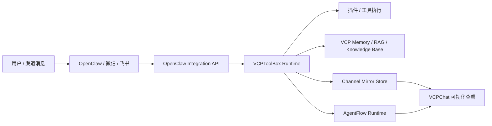
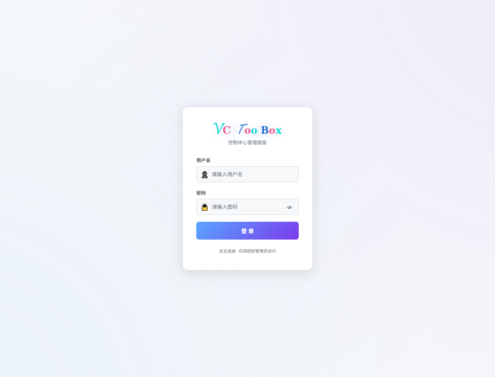
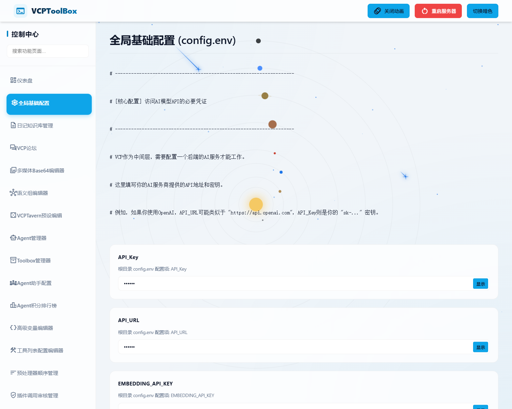
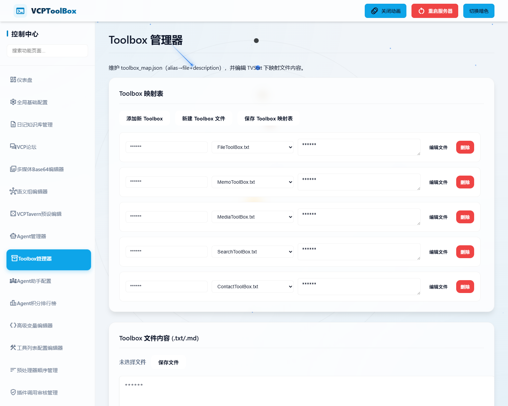
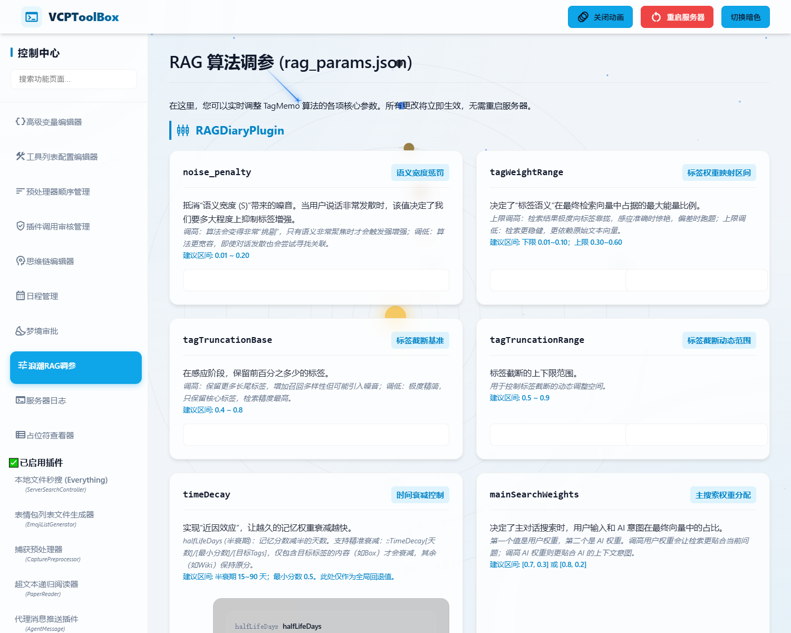

# VCPToolBox OpenClaw Fork

[](https://github.com/hx676/vcptoolbox-openclaw)
[](https://github.com/hx676/vcpchat-openclaw)
[](https://github.com/hx676/vcptoolbox-openclaw)
[](https://github.com/hx676/vcptoolbox-openclaw)
[](https://github.com/hx676/vcptoolbox-openclaw)
[](https://github.com/hx676/vcptoolbox-openclaw)

## 首页导航

| 入口 | 说明 |
| --- | --- |
| [当前仓库](https://github.com/hx676/vcptoolbox-openclaw) | `VCPToolBox` 后端、记忆/RAG、工具、OpenClaw 集成 |
| [配套前端](https://github.com/hx676/vcpchat-openclaw) | `VCPChat` 桌面前端与可视化入口 |
| [文档目录](/E:/2026/VCPToolBox/docs/DOCUMENTATION_INDEX.md) | 当前仓库的工程文档入口 |
| [新手手册](/E:/2026/VCPToolBox/docs/BEGINNER_MANUAL.md) | 面向部署和使用的入门手册 |
| [上游项目](https://github.com/lioensky/VCPToolBox) | 原始 `VCPToolBox` 仓库 |

## 当前状态

- 当前仓库已经按 `VCP-only` 路线收口长期知识库与记忆能力。
- GitHub 首页已补齐 README、About、Description 和 Topics。
- 推荐阅读顺序是：`README -> BEGINNER_MANUAL -> docs -> paired repo -> 本地配置`。

## 一眼看懂



这个仓库负责的是后端能力层：

- 模型请求与工具执行
- 统一的记忆、知识库与写入链路
- OpenClaw 集成接口
- 渠道镜像落盘
- AgentFlow Runtime

## 截图预览

| 登录与仪表盘 | 基础配置 |
| --- | --- |
|  |  |

| 工具箱管理 | RAG 调优 |
| --- | --- |
|  |  |

这是 `VCPToolBox` 的个人二次开发版本，仓库地址为：

- 后端仓库：[hx676/vcptoolbox-openclaw](https://github.com/hx676/vcptoolbox-openclaw)
- 配套前端仓库：[hx676/vcpchat-openclaw](https://github.com/hx676/vcpchat-openclaw)
- 上游项目：[lioensky/VCPToolBox](https://github.com/lioensky/VCPToolBox)

这个仓库是当前整套系统的后端核心，主要负责：

- 模型请求转发
- 插件/工具执行
- 记忆与 RAG 检索
- OpenClaw 集成接口
- 渠道镜像事件落盘
- AgentFlow Runtime
- 与 `VCPChat`、Distributed Server、外部渠道的桥接

## 这个 Fork 的定位

如果一句话概括：

> 这是一个已经深度本地化、并且围绕 `VCP-only` 方案收口过的 VCP 后端二开仓库。

它不只是上游的直接镜像，而是已经加入了当前这套部署链路中实际在用的能力，包括但不限于：

- `OpenClaw -> VCP` 工具与知识库集成
- 会话镜像写入与渠道镜像存储
- `vcp_kb_agent_ask` / `vcp_memory_search` / `vcp_memory_write` 相关链路
- AgentFlow Runtime 与相关路由
- `vcp_chat` 分布式工具桥接

## 你应该怎么理解这个仓库

在当前双仓结构里：

- `VCPToolBox` 是后端大脑
- `VCPChat` 是桌面前端和可视化外壳

职责大致如下：

- `VCPToolBox`：API、工具、记忆、知识库、OpenClaw 集成、镜像落盘
- `VCPChat`：桌面会话、镜像查看、AgentFlow Studio、渠道展示

## 快速开始

### 1. 安装依赖

```bash
npm install
```

### 2. 准备配置

先复制示例配置：

```bash
copy config.env.example config.env
```

然后按你的本机环境修改 [config.env](/E:/2026/VCPToolBox/config.env)。

注意：

- GitHub 仓库里不会包含你的真实 `config.env`
- 本地私有配置、账号数据、镜像数据、浏览器 profile 等都已排除出版本控制

### 3. 启动服务

```bash
node server.js
```

如果你使用批处理脚本，也可以结合这些文件：

- [start_server.bat](/E:/2026/VCPToolBox/start_server.bat)
- [ensure-node-deps.bat](/E:/2026/VCPToolBox/ensure-node-deps.bat)
- [start_ccproxy_codex.ps1](/E:/2026/VCPToolBox/start_ccproxy_codex.ps1)

## 一键启动与日志

推荐的本地启动方式：

- [start_server.bat](/E:/2026/VCPToolBox/start_server.bat)
  作用：先检查依赖，再直接启动 `node server.js`。
- [ensure-node-deps.bat](/E:/2026/VCPToolBox/ensure-node-deps.bat)
  作用：发现 `node_modules` 缺失时自动执行 `npm install`。
- [start_ccproxy_codex.ps1](/E:/2026/VCPToolBox/start_ccproxy_codex.ps1)
  作用：当前仓库里和 `ccproxy` 相关的辅助启动脚本。

如果你是从前端一键拉起整套系统，也可以直接从 `VCPChat` 侧运行：

- [一键启动VCPChat.bat](/E:/2026/VCPChat/一键启动VCPChat.bat)

本地日志常见位置：

- `vcp.stdout.log`
- `vcp.stderr.log`
- `vcp.stdout.prev.log`
- `vcp.stderr.prev.log`

## 当前 Fork 里比较重要的定制能力

### 1. OpenClaw 集成

当前仓库已经加入 OpenClaw 相关后端接口与桥接逻辑，核心目标是：

- 让 OpenClaw 把 VCP 当成统一知识库/记忆/工具后端
- 让飞书、微信等渠道的会话能镜像回 VCP 体系
- 保持 OpenClaw 负责渠道和调度，VCP 负责知识、记忆、工具和可视化落盘

相关入口：

- [routes/openclawIntegrationRoutes.js](/E:/2026/VCPToolBox/routes/openclawIntegrationRoutes.js)
- [modules/openclaw/channelMirrorStore.js](/E:/2026/VCPToolBox/modules/openclaw/channelMirrorStore.js)

### 2. AgentFlow Runtime

当前仓库已经承载 AgentFlow 后端运行时相关实现，配套前端位于 `VCPChat/AgentFlowStudio`。

建议连同这些文档一起看：

- [DOCUMENTATION_INDEX.md](/E:/2026/VCPToolBox/docs/DOCUMENTATION_INDEX.md)
- [ARCHITECTURE.md](/E:/2026/VCPToolBox/docs/ARCHITECTURE.md)
- [MEMORY_SYSTEM.md](/E:/2026/VCPToolBox/docs/MEMORY_SYSTEM.md)
- [BEGINNER_MANUAL.md](/E:/2026/VCPToolBox/docs/BEGINNER_MANUAL.md)

### 3. VCP-only 知识库与记忆路线

当前二开方向已经明确为：

- 长期知识库统一走 VCP
- 记忆搜索与写入统一走 VCP
- OpenClaw 不再把本地 `MEMORY.md` 当长期知识源
- 本地短期会话上下文仍留在 OpenClaw 自己的 session 内

## 目录建议先看这些

- [server.js](/E:/2026/VCPToolBox/server.js)：服务入口
- [Plugin.js](/E:/2026/VCPToolBox/Plugin.js)：插件系统核心
- [KnowledgeBaseManager.js](/E:/2026/VCPToolBox/KnowledgeBaseManager.js)：知识库管理
- [WebSocketServer.js](/E:/2026/VCPToolBox/WebSocketServer.js)：分布式服务与实时通信
- [routes](/E:/2026/VCPToolBox/routes)：HTTP 路由
- [modules](/E:/2026/VCPToolBox/modules)：核心模块
- [Plugin](/E:/2026/VCPToolBox/Plugin)：插件目录
- [docs](/E:/2026/VCPToolBox/docs)：工程文档

## 公开仓库已刻意排除的内容

为了避免把本机私有内容公开，这个 fork 已经从版本控制里剥离或忽略了以下内容：

- 本地 `config.env`
- 账号认证数据
- 浏览器 profile
- 渠道镜像运行数据
- 本地缓存、备份文件和临时目录

所以如果你 fork 之后发现少了这些，不是仓库坏了，而是这些本来就不应该上传到 GitHub。

## 与上游差异

这个 fork 当前和上游相比，已经形成了比较明确的二开方向：

- 新增 OpenClaw 集成接口与渠道镜像存储链路
- 确认长期知识库与记忆统一走 `VCP-only` 路线
- 补齐 `vcp_kb_agent_ask`、`vcp_memory_search`、`vcp_memory_write` 相关使用场景
- 承载 AgentFlow Runtime 及其运行接口
- 为公开 fork 清理了本地 `config.env`、账号认证数据、镜像数据和浏览器 profile

也就是说，这个仓库不是“原版 VCPToolBox 的直接镜像”，而是已经适配你当前本机实际部署链路的后端主仓。

## 适合谁

这个仓库更适合：

- 已经在本地长期跑 VCP 的开发者
- 想把 OpenClaw、微信、飞书接到 VCP 后端的人
- 想继续在上游基础上做深度二开的开发者

如果你只是想先体验 VCP 原始能力，可以先参考上游；如果你想复现当前这套整合链路，就以这个 fork 为准。

## 上游与同步建议

当前远程关系已经按 fork 方式整理：

- `origin`：你的 fork
- `upstream`：上游原仓库

建议后续同步方式：

1. 先在本仓库开发和验证
2. 需要跟上游同步时，从 `upstream` 拉取
3. 手动解决与你本地定制相关的冲突

不要直接用上游覆盖本地配置和集成改动。

## License

本 fork 继续尊重上游项目原有许可、署名和使用边界。二开部分请结合上游仓库声明一并理解。
