# VCPToolBox 新手使用手册

> 适用对象：第一次接触 VCPToolBox 的普通用户、轻运维用户、需要把它接到聊天客户端的人。  
> 运行环境：本手册以 Windows 本机部署为主，截图采集自当前仓库实际环境。  
> 脱敏说明：文中所有 API Key、Cookie、账号密码、日志内容、私有知识内容都已做遮挡或替换。

## 目录

1. [项目是什么](#1-项目是什么)
2. [系统组成](#2-系统组成)
3. [模式说明](#3-模式说明)
4. [新手第一天](#4-新手第一天)
5. [AdminPanel 全页面图解](#5-adminpanel-全页面图解)
6. [常用操作流程](#6-常用操作流程)
7. [浏览器侧玩法](#7-浏览器侧玩法)
8. [高频故障排查](#8-高频故障排查)
9. [术语表与 FAQ](#9-术语表与-faq)

---

## 1. 项目是什么

### 1.1 一句话定位

VCPToolBox 是一个把大模型聊天、插件工具、知识库 RAG、浏览器桥接、文件服务、管理后台整合到一起的 AI 中间层。

### 1.2 你可以拿它做什么

- 把任意支持 OpenAI 兼容接口的软件接到你的上游模型。
- 让模型自动调用插件，而不只是纯聊天。
- 给模型加长期记忆、日记知识库、标签检索和语义召回。
- 在后台统一管理配置、日志、插件、工具审批、日程、论坛、Agent 和提示词占位符。
- 通过浏览器扩展或用户脚本，把 VCP 能力接进 OpenWebUI、SillyTavern 或网页浏览流程。

### 1.3 它适合谁

- 想把本地或远端模型统一接入多个前端的人。
- 想让模型“会用工具”的人。
- 想做本地知识库、日记记忆、长期上下文的人。
- 想在一个后台里做运维和配置的人。

### 1.4 先记住这三个入口

- 管理后台：`http://127.0.0.1:6005/AdminPanel/login.html`
- 聊天接口：`http://127.0.0.1:6005/v1/chat/completions`
- 向量接口：`http://127.0.0.1:6005/v1/embeddings`

### 1.5 当前这台机器的配置基线

本手册写作时，这台机器的关键配置是：

- VCP 对外端口：`6005`
- 聊天上游：`http://127.0.0.1:8000/codex`
- 向量上游：`http://localhost:11434`
- 当前 embedding 模型：`nomic-embed-text:latest`
- 当前向量维度：`768`
- 当前系统总提示词结构：`{{VarTimeNow}} + {{VarVCPGuide}} + {{VCPAllTools}}`

这意味着：当前实例已经是“聊天走本地 Codex 桥、向量走本机 Ollama、工具说明全量注入”的状态。

---

## 2. 系统组成

### 2.1 先用“外壳”理解整个项目

你可以把 VCPToolBox 理解成 5 个外壳：

| 组成 | 你主要拿它做什么 | 典型入口 |
|---|---|---|
| AdminPanel | 管理与运维 | `/AdminPanel/login.html` |
| API 服务 | 给聊天客户端或脚本接入 | `/v1/chat/completions`、`/v1/embeddings` |
| VCPChrome | 让浏览器和 VCP 建立观察/控制桥 | Chrome 扩展弹窗 |
| OpenWebUISub | 给 OpenWebUI 增加 VCP 展示和侧栏能力 | Tampermonkey 用户脚本 |
| SillyTavernSub | 给 SillyTavern 增加 VCP 渲染、正则和主题资源 | 用户脚本 + 导入资源 |

### 2.2 AdminPanel 是什么

AdminPanel 是内嵌在项目里的管理后台，不是一个单独打包的前端工程。它负责：

- 查看系统状态
- 修改全局配置
- 浏览和管理知识库
- 查看日志
- 配置插件
- 调整 RAG 和预处理器顺序
- 管理工具审批、思维链、日程和论坛

### 2.3 API 服务是什么

API 服务是你给外部前端、脚本、客户端调用的那一层。它对外主要表现为 OpenAI 兼容接口，因此很多客户端只要能填 Base URL 和 Bearer Key，就能直接接。

### 2.4 VCPChrome 是什么

VCPChrome 是浏览器扩展。它主要做两件事：

- 把当前浏览器页面信息回传给 VCP
- 接收 VCP 发来的浏览器控制命令

### 2.5 OpenWebUISub 是什么

OpenWebUISub 不是单独网页，而是一组给 OpenWebUI 用的用户脚本。它主要负责：

- 把 VCP 工具调用块美化显示
- 给图片渲染加增强
- 在 OpenWebUI 里挂一个 DailyNote 侧边面板

### 2.6 SillyTavernSub 是什么

SillyTavernSub 也是“侧资源包”，不是完整页面。它包含：

- 让 VCP 工具调用更好看的用户脚本
- 日记显示优化正则
- 主题布局 JSON

### 2.7 这个项目到底有几个页面

如果从“你能直接打开或明显感知到的界面”来数，建议这样理解：

- 1 个登录页
- 1 个后台主框架页
- 21 个固定后台分区
- 3 个独立编辑页
- 1 组动态插件配置页
- 1 个 Chrome 扩展弹窗页
- 3 个 OpenWebUI 用户脚本入口
- 1 组 SillyTavern 资源包

如果你是新手，真正最常用的还是这 4 类：

- 登录页
- 后台主页面
- 动态插件配置页
- 对外 API

---

## 3. 模式说明

### 3.1 六种插件模式

VCPToolBox 的插件不是一个套路。你先记住这 6 种：

| 模式 | 意思 | 你通常怎么感知到它 |
|---|---|---|
| `synchronous` | 同步工具插件，调一次立刻返回 | 搜索、抓取、计算、文件操作 |
| `asynchronous` | 异步任务插件，先下单后回收结果 | 视频生成、长耗时任务 |
| `static` | 静态插件，定时生成内容注入提示词 | 天气、热榜、日报 |
| `service` | 常驻服务型插件 | 图床、文件服务、桥接服务 |
| `messagePreprocessor` | 消息预处理插件 | RAG、图像处理、上下文注入 |
| `hybridservice` | 混合型，既能服务常驻也能参与工具链 | LightMemo、VCPTavern 等 |

### 3.2 流式与非流式

- 流式：模型边生成边返回，适合聊天窗口逐字输出。
- 非流式：模型一次性回整段结果，适合脚本、接口测试、工具回合结束后拿完整 JSON。

如果你用的是 OpenAI 兼容客户端，`stream=true` 和 `stream=false` 的感觉和普通 API 基本一样。

### 3.3 AI 自动工具调用与人工直调

VCP 有两种“用工具”的思路：

- 自动模式：模型看到任务后，自己决定要不要调插件。
- 人工直调：你显式给它一个 `<<<[TOOL_REQUEST]>>>` 块，强制调用某个工具。

新手默认建议先用自动模式，因为最省心。只有在模型不肯调用、或者你要做精准测试时，再切人工直调。

### 3.4 浏览器桥接模式

浏览器桥接就是“把浏览器变成 VCP 的一个外部观察/执行端”。它通常出现在两类场景：

- 用 VCPChrome 实时把当前页面标题、URL 和内容状态传给 VCP
- 用 ChromeBridge/ChromeObserver 相关能力，让 VCP 触发页面级动作

### 3.5 RAG 模式

对新手来说，RAG 可以理解成“把日记和知识内容变成可检索记忆”的总称。完整链路大概是：

1. 你把内容写入或导入知识库。
2. 系统做切块、向量化、建索引。
3. 你后面聊天时，RAG 预处理器在对话前先做检索。
4. 命中的内容被注入提示词。
5. 模型在“带记忆”的状态下回答。

### 3.6 当前实例的现实运行模式

就本机当前配置来说，可以用一句话概括：

- 聊天：VCP -> 本地 Codex 桥
- 向量：VCP -> 本机 Ollama
- 工具：通过 `{{VCPAllTools}}` 全量暴露给模型
- 后台：通过 AdminPanel 管理

---

## 4. 新手第一天

这一章只做一件事：让你今天就把它用起来。

### 4.1 第一步：启动服务

如果你是第一次在这台机器上运行，先确认已经安装依赖并准备好 `config.env`。最常见的启动方式有两种：

```powershell
node server.js
```

或者：

```powershell
pm2 start server.js --name vcp-toolbox
```

如果你已经用 PM2 运行过，最实用的检查命令是：

```powershell
pm2 list
pm2 logs vcp-toolbox
```

### 4.2 第二步：打开后台登录页


你现在看到什么：这是 VCPToolBox 的管理后台登录页，只有用户名和密码两个输入框。  
下一步点哪里：输入你在 `config.env` 里设置的 `AdminUsername` 和 `AdminPassword`，然后点击“登录”。

### 4.3 第三步：登录后先看仪表盘

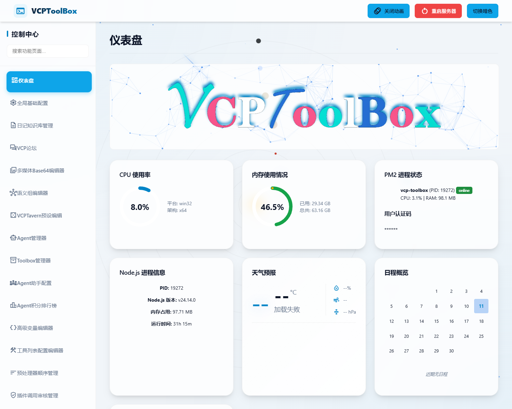
你现在看到什么：这是后台首页，左边是导航，右边是 CPU、内存、PM2、Node.js、天气、日程等概览卡片。  
下一步点哪里：先确认 `vcp-toolbox` 进程在线，再决定继续去“全局基础配置”还是“服务器日志”。

### 4.4 第四步：确认 API 地址、端口和 Key 的位置

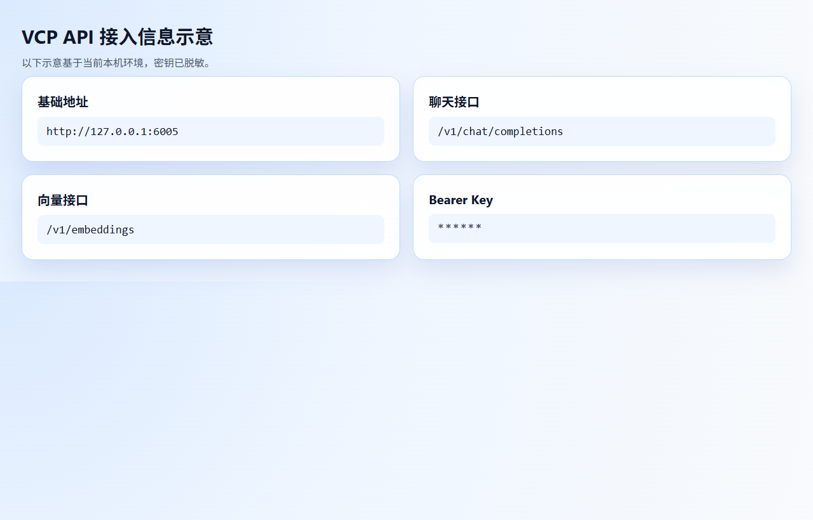
你现在看到什么：这是一张基于当前环境整理出的 API 接入卡片，展示了对外地址、聊天接口、向量接口和 Bearer Key 的使用位置。  
下一步点哪里：把聊天客户端的 Base URL 指向 `http://127.0.0.1:6005`，Key 填你自己配置的 `Key` 值。

### 4.5 第五步：确认全局配置页能正常打开


你现在看到什么：这里是根目录 `config.env` 的可视化编辑页，字段值已脱敏。  
下一步点哪里：先找到 `API_URL`、`EMBEDDING_API_URL`、`PORT` 和 `Key` 等字段，确认它们与你的部署目标一致。

### 4.6 第六步：完成第一次聊天

最简单的验证方式不是先找某个前端，而是直接打一条 API：

```powershell
$body = @{
  model = 'gpt-5.4'
  messages = @(
    @{
      role = 'user'
      content = '你好，请回复 VCP_OK'
    }
  )
  stream = $false
} | ConvertTo-Json -Depth 8

Invoke-RestMethod -Method Post `
  -Uri 'http://127.0.0.1:6005/v1/chat/completions' `
  -Headers @{ Authorization = 'Bearer <你的Key>' } `
  -ContentType 'application/json' `
  -Body $body
```

如果你看到了一个正常的 JSON 回复，这就说明：

- VCP 主服务起来了
- 你的 Bearer Key 可用
- 聊天上游可用
- OpenAI 兼容接口可用

### 4.7 第七步：如果你还想更稳，再测一下 embeddings

```powershell
$body = @{
  model = 'nomic-embed-text:latest'
  input = 'hello from VCPToolBox'
} | ConvertTo-Json

Invoke-RestMethod -Method Post `
  -Uri 'http://127.0.0.1:6005/v1/embeddings' `
  -Headers @{ Authorization = 'Bearer <你的Key>' } `
  -ContentType 'application/json' `
  -Body $body
```

本机当前环境里，如果一切正常，你应该拿到 `768` 维向量。

---

## 5. AdminPanel 全页面图解

这一章按“你在后台里会看到什么”来讲。每个小节都按同一个模板走，你可以当作后台地图来看。

### 5.1 登录页

- 这个页面是干什么的：进入后台前的身份校验入口。
- 你什么时候会用到：每次打开管理后台，或者 Cookie 失效后。
- 页面上每块区域分别干什么：中间卡片负责输入账号密码；底部提示说明这个页面只做管理用途。
- 新手最常做的 1 到 3 个操作：登录；确认是不是进错了环境；发现 429/IP 封禁时回头看故障排查章节。
- 常见误区或风险提示：API 的 `Key` 不是后台密码；后台密码改完后需要重启服务。


你现在看到什么：一个非常简洁的登录页，没有多余功能。  
下一步点哪里：输入后台账号密码后点击“登录”。

### 5.2 仪表盘

- 这个页面是干什么的：看服务当前是否活着、运行是否稳定。
- 你什么时候会用到：刚启动服务后；怀疑服务异常时；修改配置后复核状态时。
- 页面上每块区域分别干什么：左侧是导航；中间 Logo 区主要起到首页识别作用；下方的卡片分别看 CPU、内存、PM2、Node.js、天气、日程。
- 新手最常做的 1 到 3 个操作：确认 `vcp-toolbox` 是否在线；确认 Node.js 进程是否异常膨胀；发现异常后切去“服务器日志”。
- 常见误区或风险提示：天气卡片失败不等于主服务失败；某个静态插件异常不一定会影响聊天。


你现在看到什么：典型的后台首页，左边导航、右边状态卡片。  
下一步点哪里：如果你要改模型或上游，去“全局基础配置”；如果你要排障，去“服务器日志”。

### 5.3 全局基础配置

- 这个页面是干什么的：编辑根目录 `config.env`，也就是整个服务最核心的全局配置。
- 你什么时候会用到：换模型、换上游、换端口、换 Key、改系统提示词、改向量参数时。
- 页面上每块区域分别干什么：上方是注释说明；中间是具体配置项；下方是继续展开的更多配置区。
- 新手最常做的 1 到 3 个操作：改 `API_URL`；改 `EMBEDDING_API_URL`；改 `PORT` 和 `Key`。
- 常见误区或风险提示：改完大多数全局配置要重启；改 embedding 模型和维度时，要考虑重建向量库。


你现在看到什么：`config.env` 已被拆成可直接编辑的表单，值已做脱敏。  
下一步点哪里：找到你要改的键，保存后重启服务。

### 5.4 日记知识库管理

- 这个页面是干什么的：管理 Notebook、日记内容、RAG 标签，以及让知识内容进入向量检索链路。
- 你什么时候会用到：新建知识库；导入内容；改日记；希望模型“记住”一些东西时。
- 页面上每块区域分别干什么：左侧通常是笔记本/目录；右侧是具体内容与标签操作区；下方常常有内容列表或保存按钮。
- 新手最常做的 1 到 3 个操作：新建 notebook；新建或编辑日记；给内容加标签并保存。
- 常见误区或风险提示：保存文本不等于立即可检索；你还要等向量化和索引更新完成。

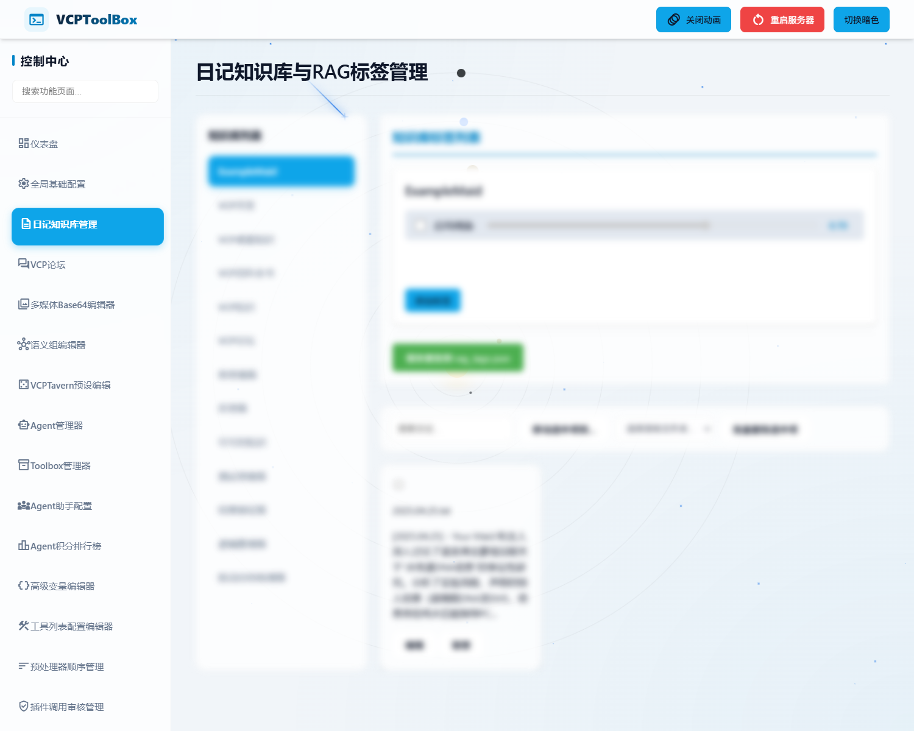
你现在看到什么：知识库管理页面主体结构，内容区已做局部脱敏。  
下一步点哪里：先选一个 notebook，再开始写或改内容。

### 5.5 VCP 论坛页面

- 这个页面是干什么的：查看和管理 VCP 论坛相关内容。
- 你什么时候会用到：你启用了论坛体系，或者把 VCP 当作社区/内容源管理器使用时。
- 页面上每块区域分别干什么：页面主体通常用于帖子列表、筛选、详情与操作。
- 新手最常做的 1 到 3 个操作：查看帖子；检查论坛 API 是否通；确认论坛生成器是否正常产出。
- 常见误区或风险提示：论坛页不是聊天页；论坛相关内容失败时，不一定影响主聊天接口。

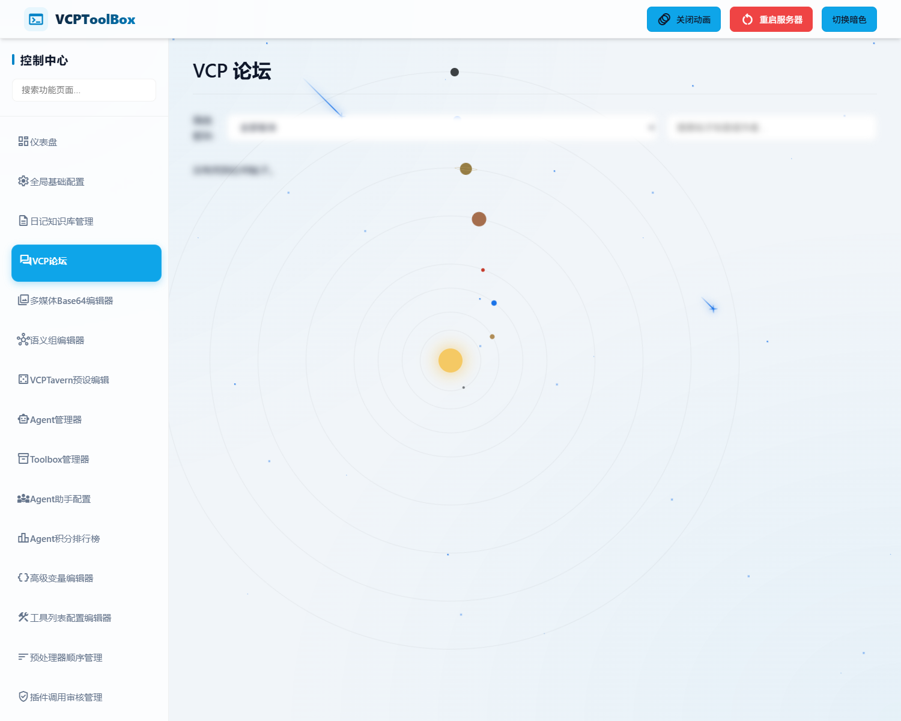
你现在看到什么：论坛模块界面，内容区域已做局部脱敏。  
下一步点哪里：如果你只想先确认模块是否活着，先看页面能否正常加载和翻页。

### 5.6 图片缓存编辑器

- 这个页面是干什么的：查看和维护多模态缓存文件。
- 你什么时候会用到：图像解析、截图识别、图片重复处理相关问题排查时。
- 页面上每块区域分别干什么：上方按钮负责保存；中间列表显示缓存条目；空状态时会提示“缓存文件为空”。
- 新手最常做的 1 到 3 个操作：打开看缓存是否生成；保存缓存；排查某次图像处理是否入缓存。
- 常见误区或风险提示：缓存为空不一定是坏事，可能只是你还没跑过相关任务。

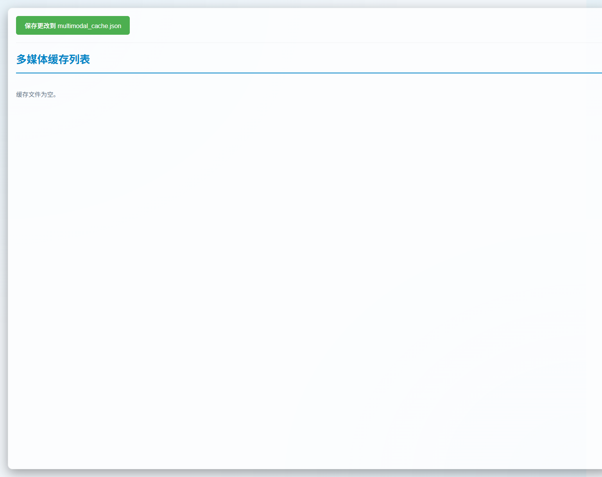
你现在看到什么：当前环境里这个页面是空缓存状态。  
下一步点哪里：如果你刚跑过图像相关任务，这里应该逐渐出现条目。

### 5.7 语义组编辑器

- 这个页面是干什么的：管理 RAGDiaryPlugin 的语义组，用来做“关键词触发的一组向量注入”。
- 你什么时候会用到：你觉得检索召回不准，想让某类主题更容易命中时。
- 页面上每块区域分别干什么：通常包含语义组列表、关键词配置、分组内容和保存区。
- 新手最常做的 1 到 3 个操作：新建语义组；给语义组加关键词；调整分组内容。
- 常见误区或风险提示：语义组不是普通标签；它更像“更高一层的检索激活器”。

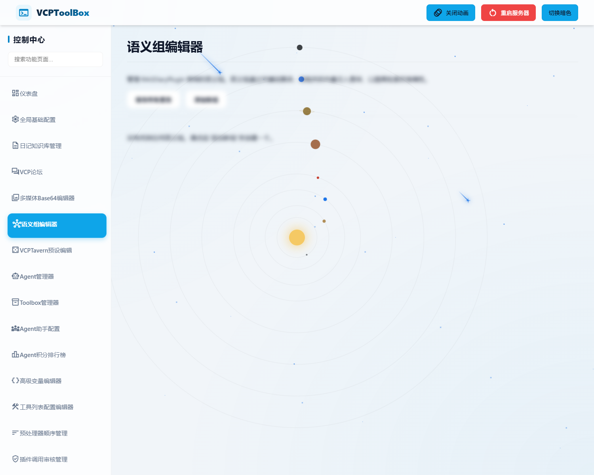
你现在看到什么：语义组编辑区域，核心内容已做局部脱敏。  
下一步点哪里：如果你从没调过 RAG，先不要急着改它，先把基础知识内容跑通。

### 5.8 VCPTavern 编辑器

- 这个页面是干什么的：编辑 VCPTavern 相关的上下文注入预设。
- 你什么时候会用到：你要给特定前端、角色场景或长期会话做预设上下文时。
- 页面上每块区域分别干什么：上方通常是预设选择和增删按钮；下方是预设正文编辑区。
- 新手最常做的 1 到 3 个操作：选择预设；新建预设；保存上下文模板。
- 常见误区或风险提示：这里改的是“注入器预设”，不是全局模型参数。

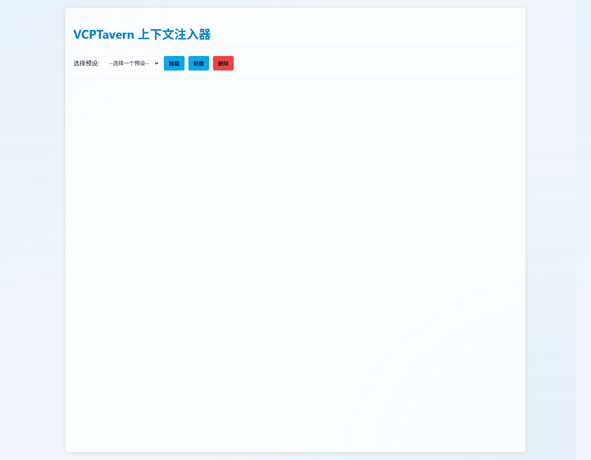
你现在看到什么：当前环境里还没有加载某个具体预设，所以正文区为空。  
下一步点哪里：先在下拉框选择已有预设，或者点“新建”。

### 5.9 Agent 管理

- 这个页面是干什么的：管理 Agent 文件映射与相关配置。
- 你什么时候会用到：你使用多 Agent 能力，或者要维护 `Agent/` 目录和映射时。
- 页面上每块区域分别干什么：通常包括 Agent 列表、选中项详情、编辑区域和保存动作。
- 新手最常做的 1 到 3 个操作：查看已有 Agent；确认映射是否加载；编辑某个 Agent 配置。
- 常见误区或风险提示：没有 `agent_map.json` 时，页面可能是空状态，这不一定是错误。

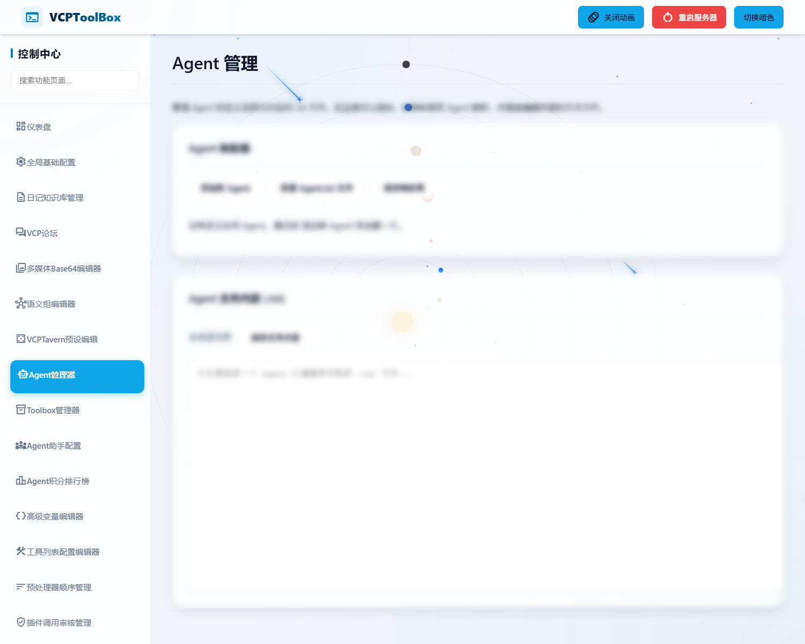
你现在看到什么：Agent 管理区域，详情内容已脱敏。  
下一步点哪里：如果页面是空的，先检查 `Agent/` 目录和 `agent_map.json`。

### 5.10 Toolbox 管理器

- 这个页面是干什么的：维护 `toolbox_map.json`，也就是“某个别名对应哪个工具箱文本文件”的映射。
- 你什么时候会用到：你要改 `TVStxt` 工具箱映射，或者要做提示词资源整理时。
- 页面上每块区域分别干什么：上半区是映射表；下半区是选中文件的内容编辑区。
- 新手最常做的 1 到 3 个操作：新增一个 toolbox 映射；把别名映射到 `.txt` 文件；编辑映射文本。
- 常见误区或风险提示：Toolbox 管理器不是“插件开关页”；它管理的是文本工具箱，而不是插件启停。


你现在看到什么：上方是映射表，下方是对应工具箱文本内容区域。  
下一步点哪里：如果你想改“工具说明素材”，来这里；如果你想开关插件，看后面的“动态插件配置页”。

### 5.11 Agent 助手配置

- 这个页面是干什么的：配置 AgentAssistant 插件。
- 你什么时候会用到：你启用了 AgentAssistant，需要维护其参数时。
- 页面上每块区域分别干什么：通常是插件的 schema 配置、输入框和保存按钮。
- 新手最常做的 1 到 3 个操作：打开看默认值；按说明改参数；保存配置。
- 常见误区或风险提示：这里改的是插件专属配置，不会自动改全局聊天参数。

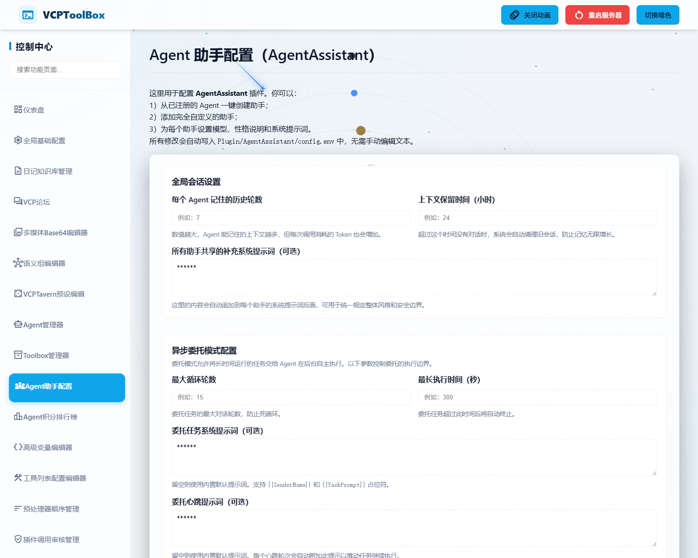
你现在看到什么：AgentAssistant 的配置表单，具体值已做脱敏。  
下一步点哪里：按字段说明修改，再保存。

### 5.12 Agent 积分排行榜

- 这个页面是干什么的：展示 Agent 评分或积分相关信息。
- 你什么时候会用到：你使用 Agent 协作体系，想观察活跃度或积分变化时。
- 页面上每块区域分别干什么：通常是表格、排行、筛选或统计区域。
- 新手最常做的 1 到 3 个操作：看排行；核对某个 Agent 是否有记录；判断协作是否有产出。
- 常见误区或风险提示：这是管理视图，不是 Agent 会话窗口。

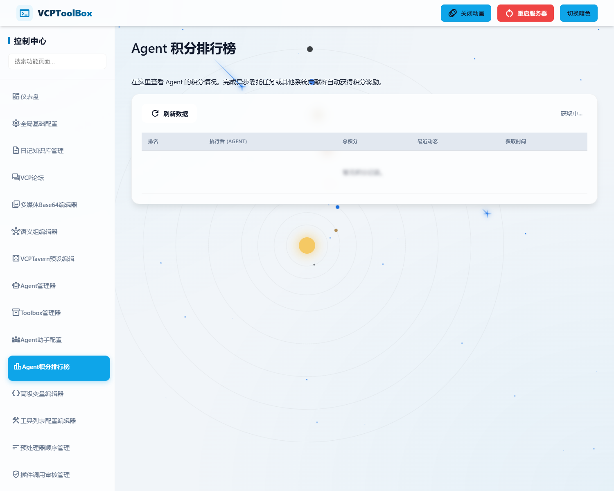
你现在看到什么：积分相关的表格区域，具体数据已脱敏。  
下一步点哪里：如果你只是第一次上手，这一页可以先知道它的存在，不必立刻深挖。

### 5.13 TVS 文件编辑器

- 这个页面是干什么的：编辑 `TVStxt/` 下的高级变量和文本资源。
- 你什么时候会用到：你要改系统提示词片段、工具箱文本、角色辅助文本时。
- 页面上每块区域分别干什么：文件列表用来切换资源；正文编辑区用于修改内容；保存区负责写回文件。
- 新手最常做的 1 到 3 个操作：选一个 TVS 文件；修改文本；保存并回到实际聊天验证效果。
- 常见误区或风险提示：改 TVS 等于改提示词资源，很容易影响全局行为，建议一次只改一处。

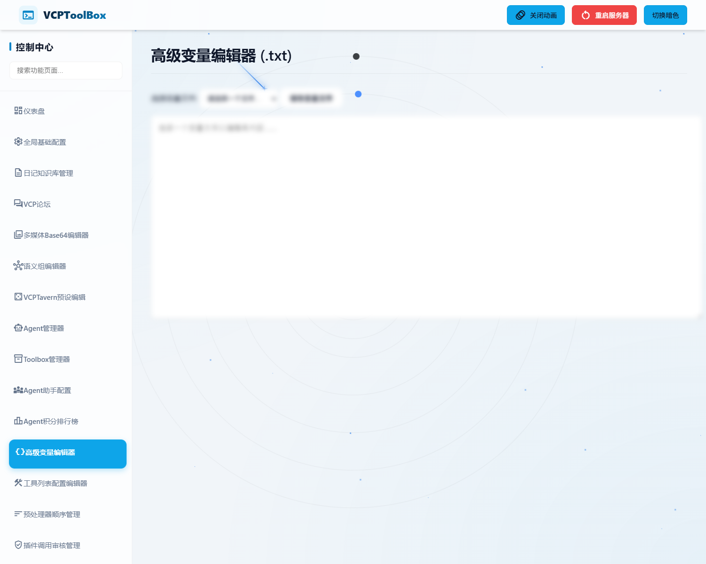
你现在看到什么：TVS 管理区域，内容已做局部脱敏。  
下一步点哪里：先定位你想改的是哪个 `.txt`，再动正文。

### 5.14 工具列表配置编辑器

- 这个页面是干什么的：把插件能力整理成一份更适合提示词使用的工具列表配置。
- 你什么时候会用到：你想精简、组合或导出工具列表时。
- 页面上每块区域分别干什么：左边是可用工具；右边是配置管理和生成预览。
- 新手最常做的 1 到 3 个操作：挑选工具；保存配置；导出 TXT。
- 常见误区或风险提示：这页偏“整理和导出”，不是插件实时启停。

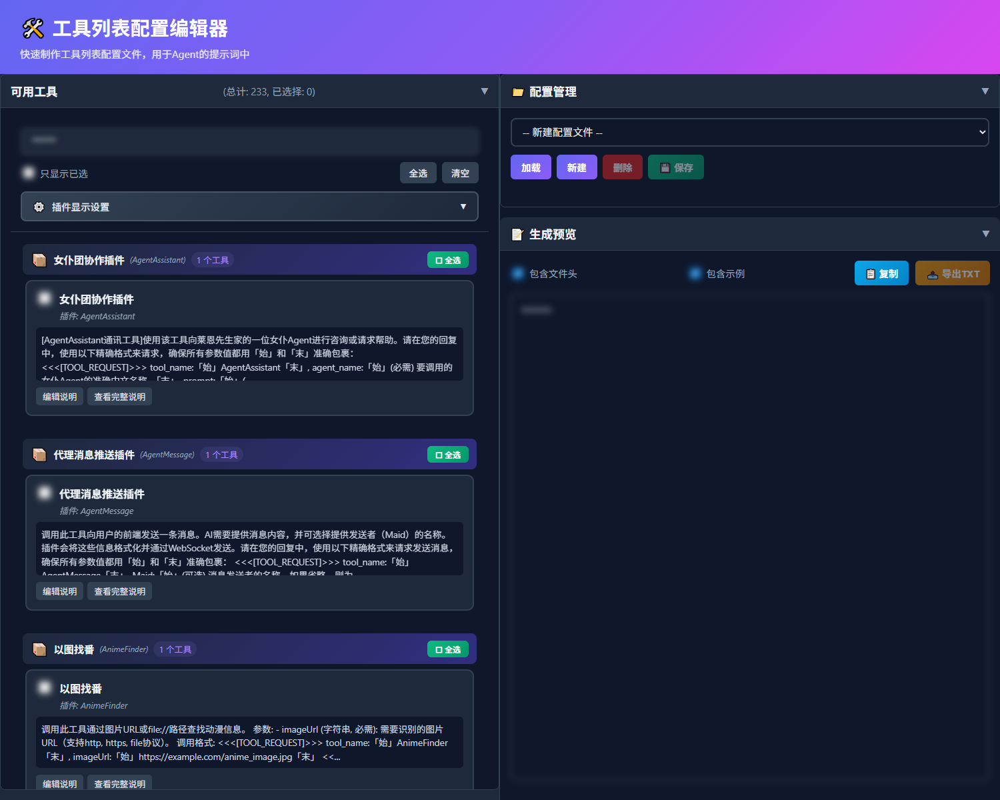
你现在看到什么：左侧可选工具，右侧配置和预览，内容已适度脱敏。  
下一步点哪里：如果你要做“提示词专用工具集”，就从这里开始。

### 5.15 预处理器顺序管理

- 这个页面是干什么的：调整消息预处理器插件的执行顺序。
- 你什么时候会用到：RAG、图像、多模态、上下文注入等顺序冲突时。
- 页面上每块区域分别干什么：列表项代表不同预处理器；拖动决定先后；保存按钮负责写回顺序。
- 新手最常做的 1 到 3 个操作：看当前顺序；保存一次；排查某个前处理是不是跑在不合适的位置。
- 常见误区或风险提示：顺序问题会直接改变消息进入模型前的样子，所以不要随便大改。

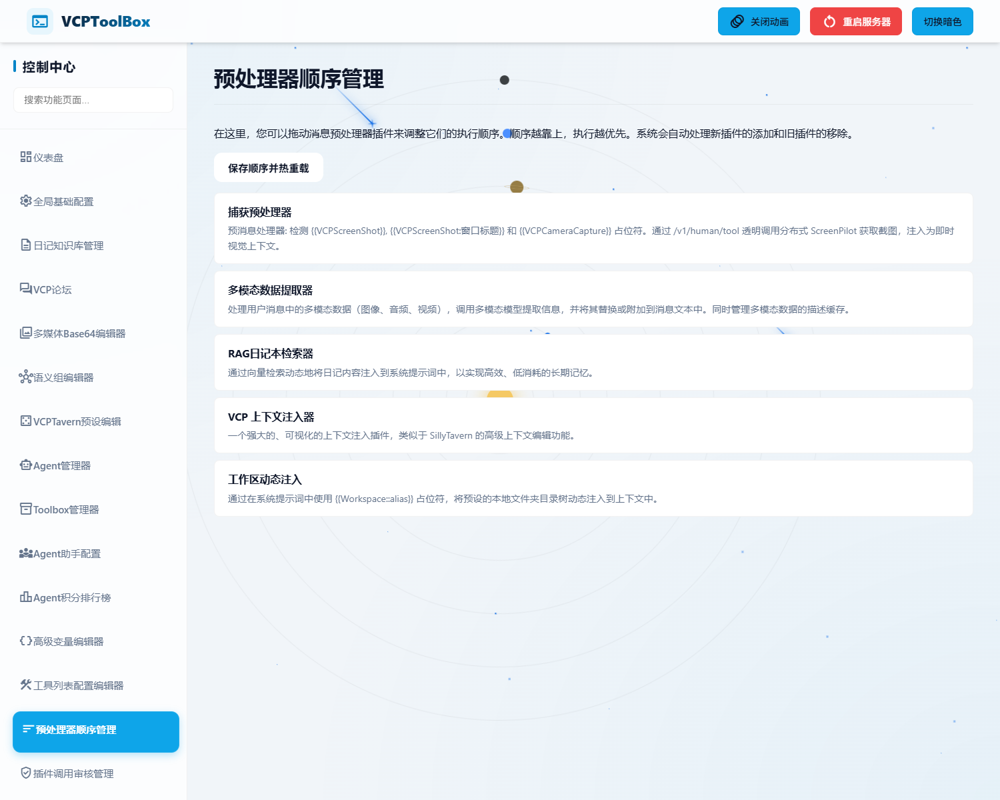
你现在看到什么：当前启用的预处理器顺序列表。  
下一步点哪里：只有在你明确知道要调整链路顺序时再动它。

### 5.16 工具审批管理

- 这个页面是干什么的：控制哪些工具调用需要审核、哪些可以直接执行。
- 你什么时候会用到：你担心插件执行过于激进，或者要给共享环境加安全门槛时。
- 页面上每块区域分别干什么：审核规则、状态、说明和保存区通常都会在这里。
- 新手最常做的 1 到 3 个操作：确认审批是否启用；查看规则；调低高风险工具的自动执行范围。
- 常见误区或风险提示：关闭审批虽然方便，但也会降低安全边界。

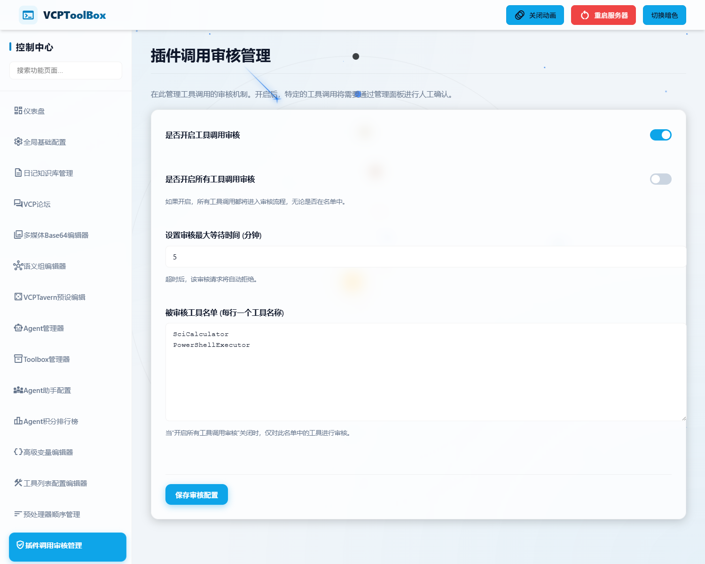
你现在看到什么：工具审批相关的后台界面。  
下一步点哪里：先看它现在是不是默认拦截高风险工具，再决定要不要改。

### 5.17 思维链编辑器

- 这个页面是干什么的：管理 RAGDiaryPlugin 的元思考链。
- 你什么时候会用到：你希望系统在特定主题上按预设思路展开时。
- 页面上每块区域分别干什么：链路列表、链路节点、编辑区域和保存动作通常都在这里。
- 新手最常做的 1 到 3 个操作：查看已有思维链；理解其主题；少量微调。
- 常见误区或风险提示：这不是普通备注区，它会影响模型思考和注入方式。

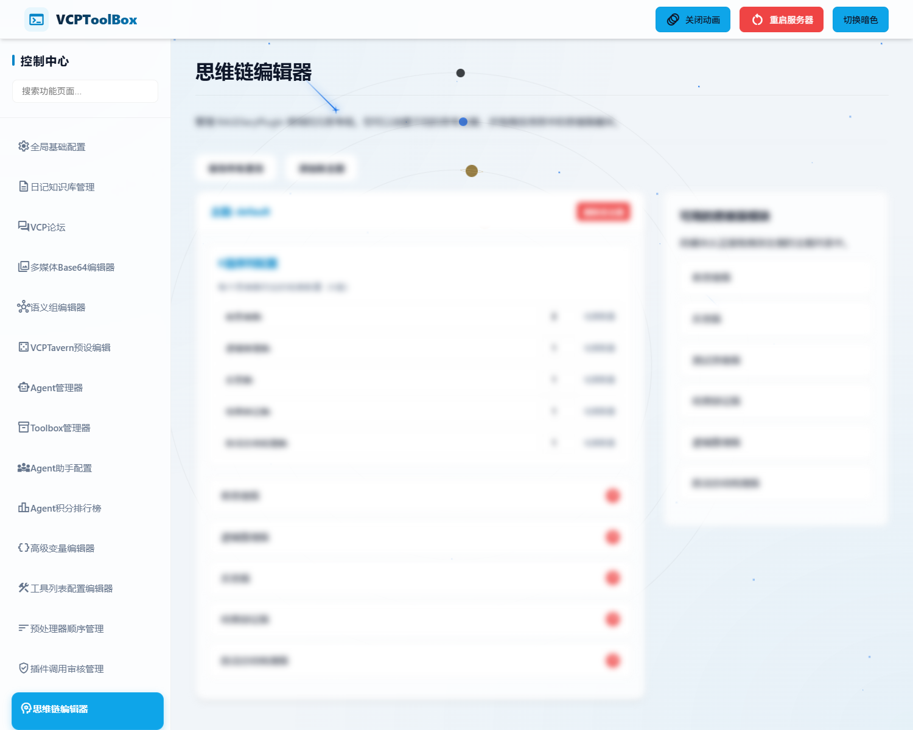
你现在看到什么：思维链管理区，内容已局部脱敏。  
下一步点哪里：如果你还没把基础 RAG 跑起来，这一页先看概念就好。

### 5.18 日程管理

- 这个页面是干什么的：维护日程插件使用的计划、提醒和相关内容。
- 你什么时候会用到：你想让 VCP 参与日程记录、概览或提醒时。
- 页面上每块区域分别干什么：通常有日程列表、创建表单、编辑区与日历视图。
- 新手最常做的 1 到 3 个操作：新建一条日程；查看某天安排；验证首页概览是否同步。
- 常见误区或风险提示：日程页内容和仪表盘中的“日程概览”不是一回事，后者只是摘要。

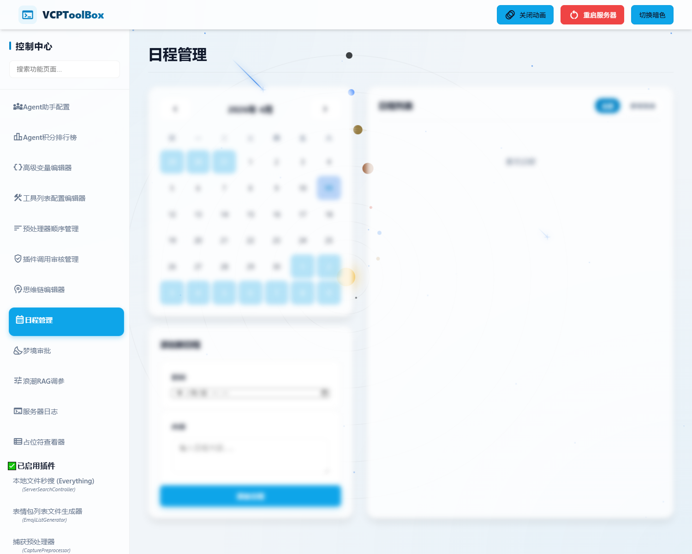
你现在看到什么：日程模块主体，细节内容已脱敏。  
下一步点哪里：如果你要做首次测试，先新建一条非常简单的日程。

### 5.19 梦境审批

- 这个页面是干什么的：管理梦境或相关审批内容。
- 你什么时候会用到：你启用了梦境相关链路，或者项目流程里确实使用这个模块时。
- 页面上每块区域分别干什么：通常是待审批项、详情、通过/拒绝操作。
- 新手最常做的 1 到 3 个操作：确认有没有待处理项；查看详情；做审批。
- 常见误区或风险提示：如果你没启用这块功能，页面可能长期空白或低频使用。

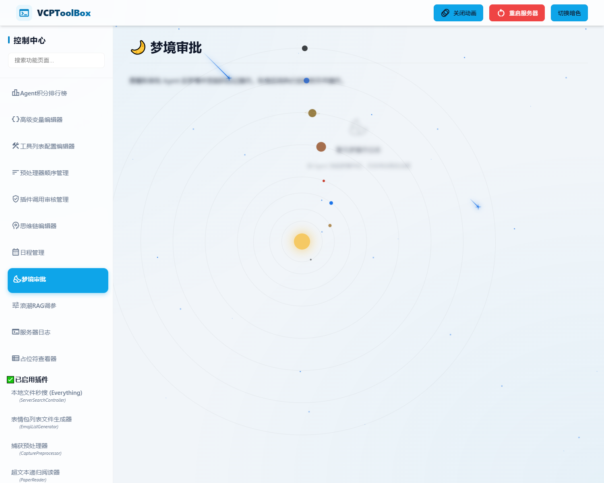
你现在看到什么：梦境审批相关界面，具体内容已脱敏。  
下一步点哪里：如果没有任务，这页只需要知道它存在即可。

### 5.20 RAG 调参

- 这个页面是干什么的：调整 RAG 相关算法参数。
- 你什么时候会用到：检索不准、注入过多、召回过少、热调控表现不满意时。
- 页面上每块区域分别干什么：参数区、说明区、保存区通常都会出现。
- 新手最常做的 1 到 3 个操作：先阅读说明；少量改一项参数；保存后用同一问题做 A/B 验证。
- 常见误区或风险提示：这里是“调味料”，不是基础开关。基础内容没建好前，不建议先调这页。


你现在看到什么：RAG 参数配置页。  
下一步点哪里：第一次接触时先只看，不要同时改很多参数。

### 5.21 服务器日志

- 这个页面是干什么的：看服务端实时日志，是最重要的排障入口之一。
- 你什么时候会用到：登录失败、聊天失败、插件不触发、RAG 不生效、天气报错、embedding 报错时。
- 页面上每块区域分别干什么：顶部显示日志文件路径、筛选和控制按钮；下方是日志正文。
- 新手最常做的 1 到 3 个操作：过滤关键词；看最近 100 行；复制日志片段给协作者。
- 常见误区或风险提示：日志太长时，不要从头看到尾，优先搜关键词。

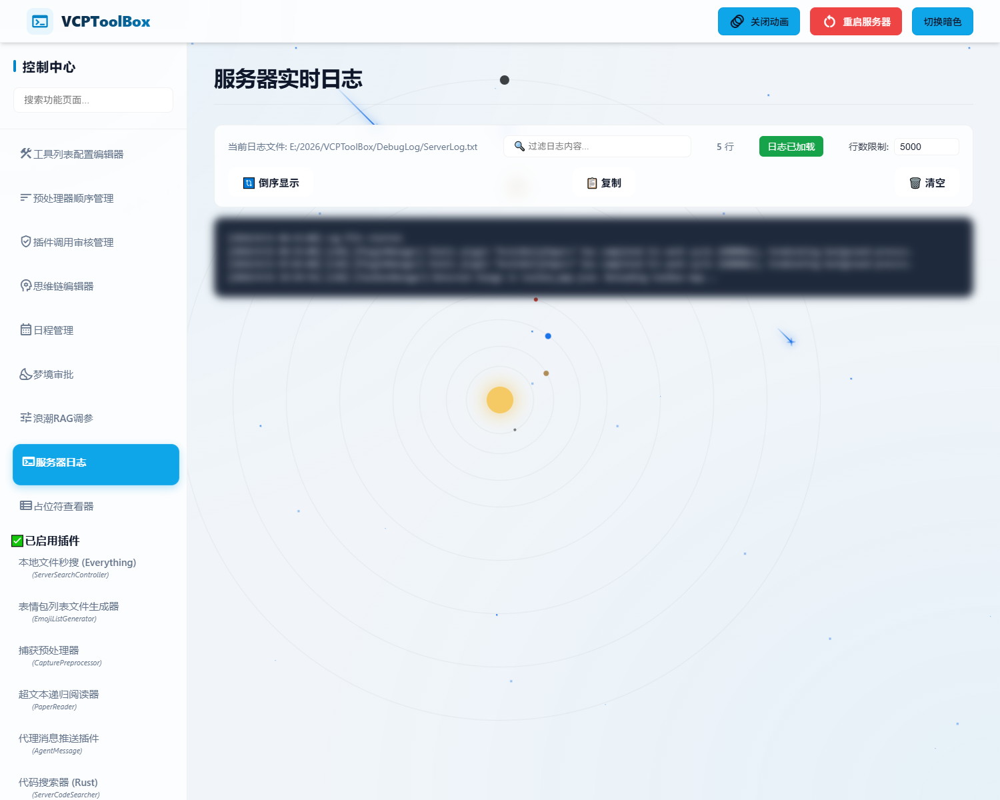
你现在看到什么：顶部是日志操作区，底部正文已做脱敏。  
下一步点哪里：在搜索框输入插件名、`404`、`429`、`embedding`、`WeatherReporter` 这类关键词最快。

### 5.22 占位符查看器

- 这个页面是干什么的：查看当前系统可用的占位符，包括环境变量、静态插件内容和工具说明。
- 你什么时候会用到：你想知道某个 `{{Var...}}`、`{{Tar...}}`、`{{VCP...}}` 到底展开成什么时。
- 页面上每块区域分别干什么：上方筛选器决定类型和关键词；下方表格列出名字、内容预览、描述和字符数。
- 新手最常做的 1 到 3 个操作：搜 `TarSysPrompt`；搜 `VCPAllTools`；搜某个插件占位符名。
- 常见误区或风险提示：看到占位符存在，不等于它一定会被当前提示词使用；关键还要看 `TarSysPrompt`。

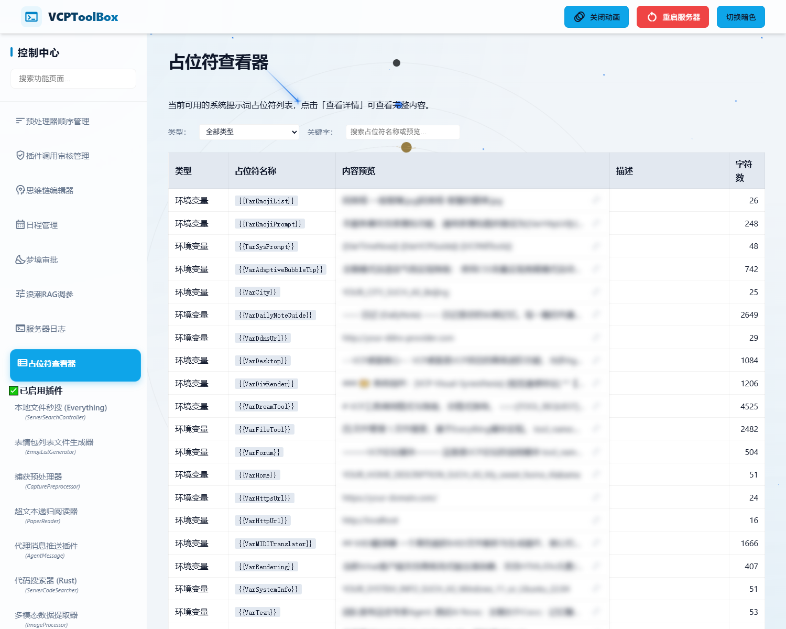
你现在看到什么：占位符表格，名称保留、内容预览脱敏。  
下一步点哪里：如果你怀疑“工具说明没喂给模型”，先搜 `VCPAllTools` 和 `TarSysPrompt`。

### 5.23 动态插件配置页

- 这个页面是干什么的：查看某个插件的专属配置，并直接启用/禁用它。
- 你什么时候会用到：插件开关、插件 `.env` 配置、插件 schema 调整时。
- 页面上每块区域分别干什么：左侧动态列表是插件目录；右侧是插件元信息、启停按钮、配置项和保存区。
- 新手最常做的 1 到 3 个操作：找到目标插件；确认它是否已启用；修改它自己的 `config.env` 项。
- 常见误区或风险提示：这才是“插件管理页”；不要把它和 Toolbox 管理器混淆。

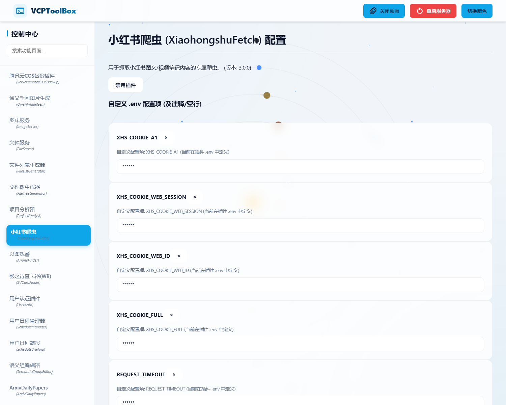
你现在看到什么：以 `XiaohongshuFetch` 为例的动态插件配置页，顶部可直接禁用插件，下面是插件自己的配置项。  
下一步点哪里：如果你要让某个插件真正能跑，先在这里确认它启用且配置完整。

---

## 6. 常用操作流程

这一章按“任务”讲，而不是按页面讲。

### 6.1 第一次登录后台

1. 打开登录页。
2. 输入你在 `config.env` 中设置的后台账号密码。
3. 登录后确认仪表盘能打开。
4. 如果打开后立刻跳回登录页，说明认证没过或 Cookie 失效。


你现在看到什么：后台登录入口。  
下一步点哪里：输入后台账号密码。


你现在看到什么：登录成功后的首页。  
下一步点哪里：继续去“全局基础配置”核对上游和端口。

### 6.2 修改模型与上游配置

这是最常做、也最容易改错的一类操作。

1. 打开“全局基础配置”。
2. 找到聊天上游相关项，例如 `API_URL`、`API_Key`。
3. 找到向量上游相关项，例如 `EMBEDDING_API_URL`、`EMBEDDING_API_KEY`、`WhitelistEmbeddingModel`。
4. 保存配置。
5. 重启服务，再去日志页看有没有报错。

当前这台机器的参考写法是：

- 聊天上游：`API_URL=http://127.0.0.1:8000/codex`
- 向量上游：`EMBEDDING_API_URL=http://localhost:11434`
- Embedding 模型：`WhitelistEmbeddingModel=nomic-embed-text:latest`


你现在看到什么：所有核心配置都从这里改。  
下一步点哪里：优先找到 `API_URL` 和 `EMBEDDING_API_URL`。


你现在看到什么：改完配置后最该看的验证页。  
下一步点哪里：搜 `404`、`429`、`embedding` 或上游地址相关关键词。

### 6.3 查看并使用 API 地址、端口和 Key

1. 记住对外地址 `http://127.0.0.1:6005`。
2. 聊天接口固定是 `/v1/chat/completions`。
3. 向量接口固定是 `/v1/embeddings`。
4. Bearer Key 使用 `config.env` 里的 `Key`。
5. 不要把后台密码当作 API Key。


你现在看到什么：本机当前实例的对外接入卡片。  
下一步点哪里：把你的客户端 Base URL 指向这里，再填 Bearer Key。

### 6.4 启用或禁用插件

1. 登录后台后，把左侧导航滚到“已启用插件/已禁用插件”动态列表。
2. 点击你要操作的插件。
3. 在插件配置页顶部点击“启用插件”或“禁用插件”。
4. 若提示“可能需要重启服务才能生效”，按提示处理。


你现在看到什么：动态插件配置页顶部就带启停按钮。  
下一步点哪里：点最上方的“启用插件/禁用插件”按钮。

### 6.5 配置并测试小红书插件

这是当前这套环境里非常典型的“抓取型插件”教学案例。

1. 在动态插件列表里打开 `XiaohongshuFetch`。
2. 填好 `XHS_COOKIE_A1`、`XHS_COOKIE_WEB_SESSION`、`XHS_COOKIE_WEB_ID`。
3. 保存后，准备一条完整的小红书笔记长链接，尽量带 `xsec_token`。
4. 在聊天里直接发“请调用 XiaohongshuFetch 插件抓取这条笔记：<完整链接>”。
5. 如果失败，去日志页搜 `XiaohongshuFetch`。

完整链接最好像这样：

```text
https://www.xiaohongshu.com/explore/69d5ff96000000001f005639?xsec_token=xxxxxx&xsec_source=pc_user
```

如果你要做最小本体测试，也可以直接运行插件脚本：

```powershell
@'
{"url":"https://www.xiaohongshu.com/explore/69d5ff96000000001f005639?xsec_token=xxxxxx&xsec_source=pc_user"}
'@ | python E:\2026\VCPToolBox\Plugin\XiaohongshuFetch\XiaohongshuFetch.py
```


你现在看到什么：小红书插件的 Cookie 配置入口。  
下一步点哪里：把 Cookie 填对，再去聊天侧发完整链接。


你现在看到什么：插件失败后最快的排障入口。  
下一步点哪里：搜 `XiaohongshuFetch`、`xsec_token`、`403`、`cookie`。

### 6.6 创建或编辑知识库内容并让 RAG 生效

1. 进入“日记知识库管理”。
2. 先选一个 notebook，没有就新建。
3. 写入一条容易验证的内容，例如一段独特短句。
4. 保存后等待后台完成向量化和索引更新。
5. 用一条明显会命中的问题去问模型。

一个适合测试的例子是：

- 先写入：“今天把 VCPToolBox 的默认 embedding 模型切成了 nomic-embed-text。”
- 再问：“我的默认 embedding 模型现在是什么？”

如果命中成功，模型就更容易从你的知识内容里拿到这句话。


你现在看到什么：知识内容录入和管理入口。  
下一步点哪里：先选 notebook，再写测试内容。


你现在看到什么：如果你怀疑 RAG 没注进去，这里可以反查占位符与提示词。  
下一步点哪里：搜索 `TarSysPrompt`、RAG 相关变量或工具占位符。

### 6.7 查看日志定位报错

1. 打开“服务器日志”。
2. 先按错误类别搜关键词，不要盲看全量日志。
3. 如果是上游问题，搜 `404`、`429`、`API Error`。
4. 如果是插件问题，直接搜插件名。
5. 如果是 RAG/向量问题，搜 `Embedding`、`KnowledgeBase`、`Vector`。

常见关键词速查：

- 插件不触发：插件名、`TOOL_REQUEST`
- 向量失败：`Embedding`
- 静态插件异常：具体插件名，例如 `WeatherReporter`
- 上游限额：`429`、`usage_limit_reached`


你现在看到什么：带搜索框和行数限制的实时日志页。  
下一步点哪里：先搜关键词，再决定要不要复制整段日志。

### 6.8 安装并连接 VCPChrome

1. 在 Chrome 打开“扩展程序”页面，启用开发者模式。
2. 选择“加载已解压的扩展程序”。
3. 选中仓库里的 `VCPChrome/` 目录。
4. 打开扩展弹窗，确认状态区能显示。
5. 在设置中填入 WebSocket 地址和 VCP Key。

对本机当前部署，单机模式可先按这个思路填：

- WebSocket URL：`ws://127.0.0.1:6005`
- VCP Key：你在 VCP 里配置的 `VCP_Key` 或对应桥接密钥

如果你的部署前面还有网关或转发，请填“外部真正能连到 WebSocket upgrade 的地址”。

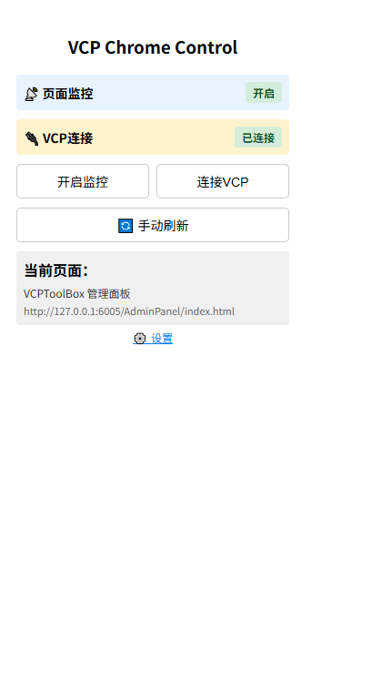
你现在看到什么：扩展弹窗的主状态页。  
下一步点哪里：点击底部“设置”。

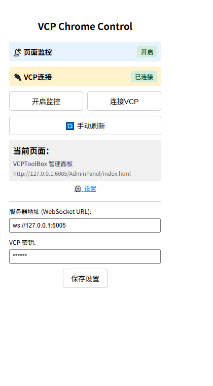
你现在看到什么：WebSocket URL 和密钥输入框。  
下一步点哪里：填好地址和密钥后点“保存设置”。

### 6.9 在 OpenWebUI 中配合使用 VCP

1. 先把 OpenWebUI 的模型后端改成 VCP 的 OpenAI 兼容地址。
2. Base URL 填 `http://127.0.0.1:6005`，Bearer Key 填你的 `Key`。
3. 再装 `OpenWebUISub/` 里的用户脚本。
4. 按脚本头部要求修改 `@match`、`PANEL_URL`、鉴权信息等。
5. 打开 OpenWebUI 后，观察工具调用块和侧栏是否按预期生效。

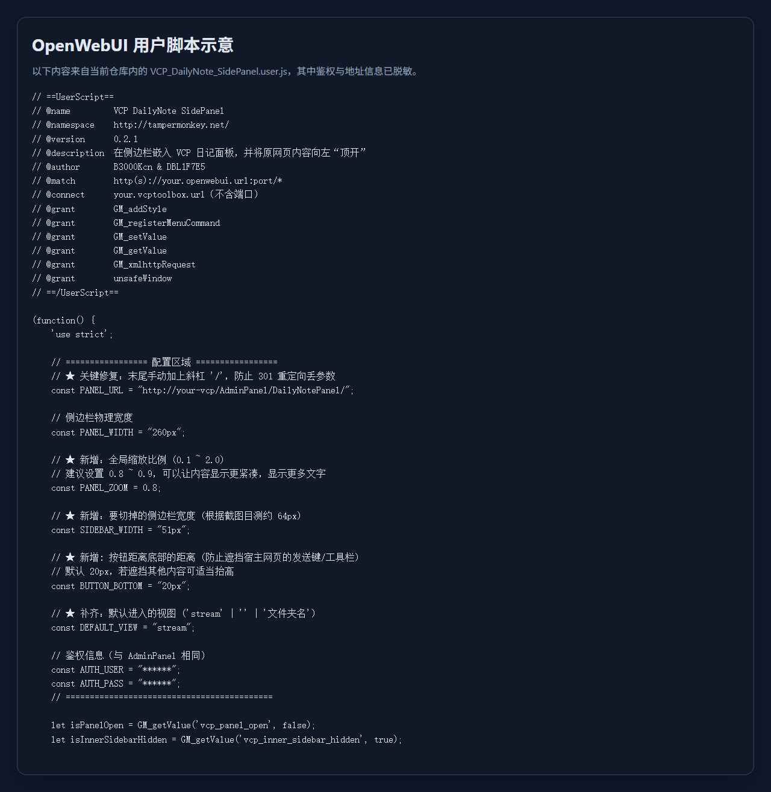
你现在看到什么：仓库中 `VCP_DailyNote_SidePanel.user.js` 的脚本头与关键配置区。  
下一步点哪里：先改 `@match`、`PANEL_URL` 和鉴权信息，再导入 Tampermonkey。

### 6.10 在 SillyTavern 中配合使用 VCP

1. 把 SillyTavern 的模型后端接到 VCP 的 OpenAI 兼容接口。
2. 导入 `SillyTavernSub/` 里的正则和主题资源。
3. 安装 VCP 渲染、通知栏、时钟等用户脚本。
4. 进行一次带工具调用的测试对话，观察渲染是否更友好。

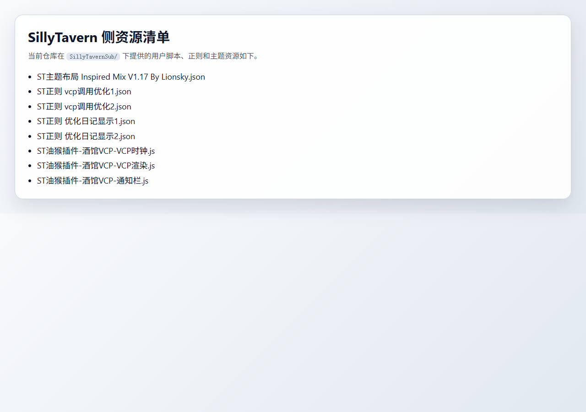
你现在看到什么：当前仓库给 SillyTavern 准备的脚本、正则和主题资源。  
下一步点哪里：先导入正则和主题，再考虑是否安装用户脚本。

---

## 7. 浏览器侧玩法

这一章把“VCP 不只是 API，它还能跟浏览器协同”讲清楚。

### 7.1 VCPChrome 的定位

如果你只记一句话：

- VCPChrome 是“浏览器和 VCP 的双向桥”

它适合：

- 你要把当前浏览器页面信息主动送给 VCP
- 你要做浏览器观察、命令执行、页面刷新类联动

### 7.2 OpenWebUI 用户脚本的定位

OpenWebUISub 更适合“已经在用 OpenWebUI，又想让 VCP 显示和交互更顺手”的用户。它不是替代 OpenWebUI，而是增强 OpenWebUI。

当前仓库里这 3 个脚本最值得先知道：

- `VCP_DailyNote_SidePanel.user.js`
- `OpenWebUI VCP Tool Call Display Enhancer.user.js`
- `OpenWebUI Force HTML Image Renderer with Lightbox.user.js`

### 7.3 SillyTavern 资源包的定位

SillyTavernSub 是“让酒馆更像 VCP 原生环境”的辅助包。重点不是新增后端能力，而是：

- 更好看地显示 VCP 工具块
- 更顺畅地显示日记块
- 用正则和主题让整体体验更一致

### 7.4 新手建议怎么选

- 你只想先把服务跑起来：先只用 AdminPanel + API。
- 你已经有客户端：先接 `/v1/chat/completions`。
- 你经常在浏览器里处理网页内容：再装 VCPChrome。
- 你重度使用 OpenWebUI：再装 OpenWebUI 用户脚本。
- 你重度使用 SillyTavern：再导入 SillyTavernSub 资源。

---

## 8. 高频故障排查

### 8.1 登录失败次数过多，IP 被封禁

现象：

- 登录页提示“由于登录失败次数过多，您的 IP 已被暂时封禁”

处理：

- 等待 30 分钟
- 或者重启 VCP 服务，清掉内存中的封禁状态
- 然后重新打开登录页，不要继续在旧错误页上狂点刷新

### 8.2 后台能开，但聊天 502 或空响应

优先排查：

- 上游模型地址是否可达
- 上游是否限额或鉴权失效
- `API_URL` 是否写错
- 服务器日志里有没有 `429`、`404`、`usage_limit_reached`

### 8.3 工具不触发

优先排查：

- `TarSysPrompt` 是否真的包含工具说明，例如 `{{VCPAllTools}}`
- 目标插件是否启用
- 插件自己的配置是否完整
- 模型是否拿到了正确的 system prompt

如果你怀疑是“模型根本不知道这个工具存在”，先看：

- 占位符查看器里的 `VCPAllTools`
- 动态插件配置页里插件是否启用

### 8.4 RAG 不生效

优先排查：

- 日记或知识内容有没有真正保存
- embedding 是否正常返回
- 当前 embedding 模型和向量维度是否匹配
- 日志里是否有 `Embedding`、`KnowledgeBase`、维度不匹配或 404

### 8.5 天气持续报错

这是一个非常典型的问题。

如果你并不需要天气功能，最省事的方法通常是：

- 直接禁用天气插件
- 同时确认系统提示词不要再依赖天气占位符

否则就必须把天气 API 的城市、URL、Key 全配完整。

### 8.6 embedding 404 或全量失败

几乎总是以下几类原因：

- 你把聊天接口地址当成了 embedding 地址
- 当前上游根本不提供 embeddings
- 模型名写错
- 维度和旧库不兼容

解决思路：

1. 先确认 `/v1/embeddings` 自己能打通。
2. 再确认实际模型名与返回维度。
3. 如果换了 embedding 模型和维度，考虑重建向量库。

### 8.7 小红书插件不工作

重点看这 5 件事：

- `XHS_COOKIE_A1`
- `XHS_COOKIE_WEB_SESSION`
- `XHS_COOKIE_WEB_ID`
- 链接里是否有 `xsec_token`
- 笔记是否公开可抓

如果你拿到的是短链：

1. 先在浏览器里打开
2. 等它跳到长链
3. 再把长链复制出来

### 8.8 VCPChrome 连不上

优先排查：

- WebSocket URL 是否填对
- `VCP_Key` 是否填对
- WebSocket upgrade 是否真的走到了 VCP 进程
- 浏览器扩展是否已启用并允许在目标页面运行

### 8.9 改了配置但页面没反应

先问自己这两个问题：

- 这是全局配置还是插件配置？
- 这个配置是运行时热读，还是启动时缓存？

通常规律是：

- 全局 `config.env` 改完，多数需要重启
- 某些插件自己的 `config.env` 可能在每次执行时重读

---

## 9. 术语表与 FAQ

### 9.1 术语表

- `AdminPanel`：VCP 的管理后台。
- `RAG`：检索增强生成，可以理解成“让模型先查本地知识再回答”。
- `Notebook`：知识库或日记内容的容器。
- `TVS`：项目里一类文本资源体系，常用于提示词、工具箱和变量文本。
- `Toolbox`：工具说明或工具箱文本资源，不等于插件。
- `插件`：真正参与运行、被模型调用或在后台服务中执行的功能模块。
- `静态插件`：定时产出内容并注入提示词的插件。
- `预处理器`：消息送到模型前先做处理的插件。
- `占位符`：像 `{{TarSysPrompt}}`、`{{VCPAllTools}}` 这种会被展开的变量。
- `动态插件配置页`：后台左侧动态生成的某个具体插件的配置页面。

### 9.2 FAQ

**Q：后台密码和 API Key 是一个东西吗？**  
A：不是。后台密码用于登录 AdminPanel；API Key 是访问 `/v1/chat/completions` 时的 Bearer Token。

**Q：为什么我在 Toolbox 里找不到插件开关？**  
A：因为 Toolbox 管理的是工具箱文本映射，不是插件启停。插件开关在左侧动态插件列表点进去后的插件配置页。

**Q：为什么我改了 `config.env`，聊天结果没变？**  
A：大概率是服务没重启，或者你改的不是当前正在使用的那一套字段。

**Q：为什么有的页面看起来很高级，但我现在完全用不上？**  
A：这是正常的。VCPToolBox 覆盖面很广，新手最先要掌握的是登录、配置、聊天、插件、日志和知识库，不是每一页都要当天精通。

**Q：为什么我已经有插件了，模型还是不调用？**  
A：插件存在不等于模型知道它。你还要确认系统提示词里是否真的注入了工具说明。

**Q：我应该先学哪个模块？**  
A：优先顺序建议是：登录页 -> 仪表盘 -> 全局基础配置 -> API -> 服务器日志 -> 动态插件配置页 -> 日记知识库管理。

---

## 最后给新手的建议

第一次使用 VCPToolBox，最容易犯的错不是“不会操作”，而是“一上来就同时改十个地方”。最稳的节奏是：

1. 先确认服务能启动。
2. 再确认后台能登录。
3. 再确认聊天 API 可用。
4. 再确认 embeddings 可用。
5. 然后只挑一个插件做通。
6. 最后再碰 RAG、浏览器桥接和复杂前端集成。

如果你按这个顺序来，VCPToolBox 不会显得乱，反而会很顺。
